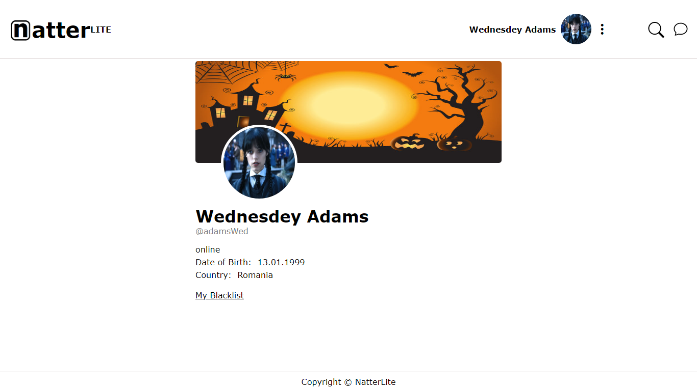
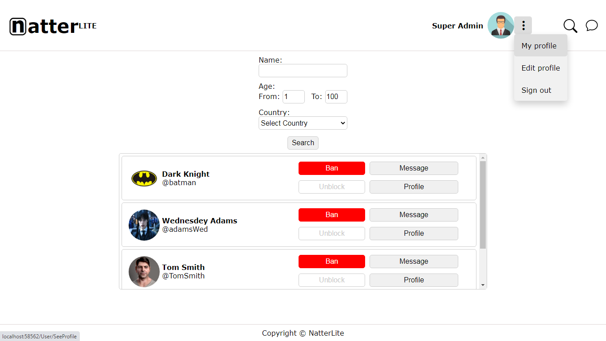

# NatterLite Chat
NatterLite is lightweight online chatting web application. User can create account, find other people,
send messages, edit his profile data, see other's users profiles, add unwanted users to blacklist.
App has two roles for users: "user" and "admin". Admin has some additional abilities such as banning of users.
Microsoft SignalR used to implement real-time communication, Asp.Net Core Identity as authentication technology.
Server-side caching added to improve performance. Server and client-side validation also included.
NLog used for logging.

#### Profile view:

#### Chat:

#### Admin search menu:

# Features
- C#
- HTML
- CSS
- Asp.Net Core 5
- MVC
- Entity Framework Core
- SQL Server Express
- Asp.Net Identity
- Filters
- SignalR
- MemoryCache
- NLog
- AJAX
- Cookies
- Authorization/Authentication
- Visual Studio 2019 IDE
